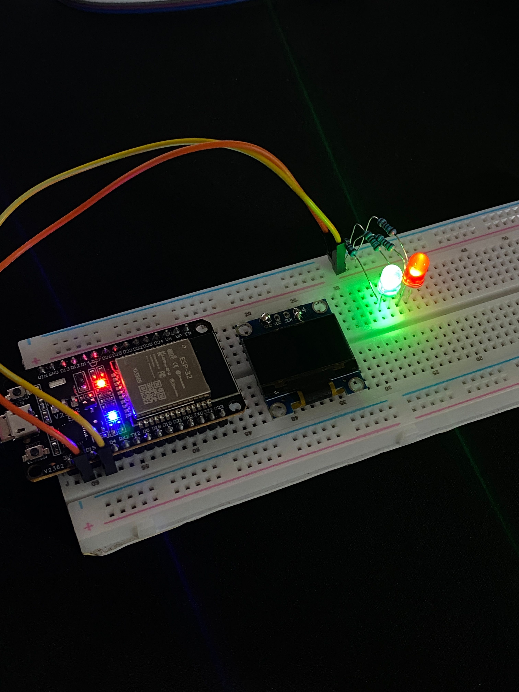
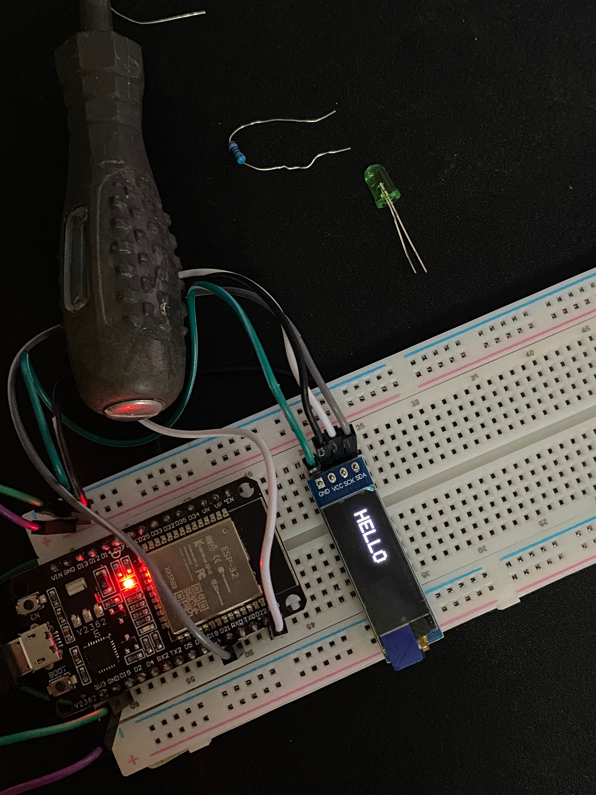
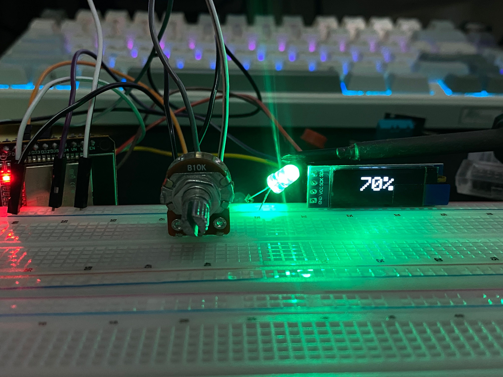
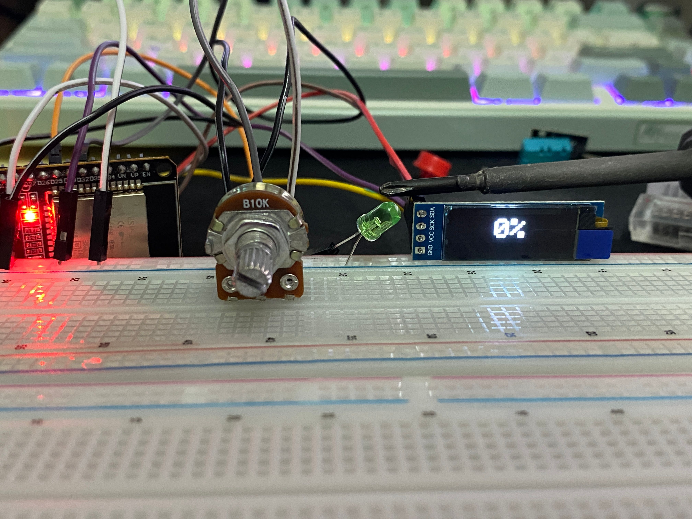

# เรียน Microcontroller ด้วย ESP32

<h3>💡 <a href="led/">LED Blink</a></h3>

  

สั่ง GPIO เปิด/ปิด LED กะพริบทุก 1 วินาที

<h3>🖥️ <a href="display-oled/">Display OLED</a></h3>

  

ต่อจอ OLED 128×32 ผ่าน I2C แสดงข้อความ HELLO

<h3>🌡️ <a href="temperature-oled/">Temperature + OLED</a></h3>

  
  

อ่านเซ็นเซอร์ DHT11 สลับแสดงอุณหภูมิ–ความชื้นบน OLED

<h3>🎛️ <a href="potentiometer-control-led/">Potentiometer Control LED + OLED</a></h3>

  
  

หมุน Potentiometer หรี่ไฟ LED ด้วย PWM พร้อมแสดงเปอร์เซ็นต์บน OLED

