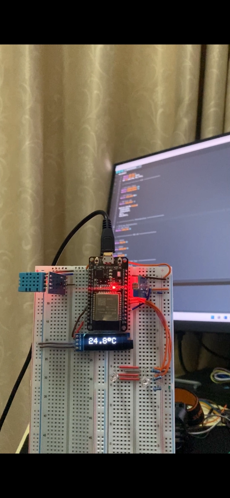
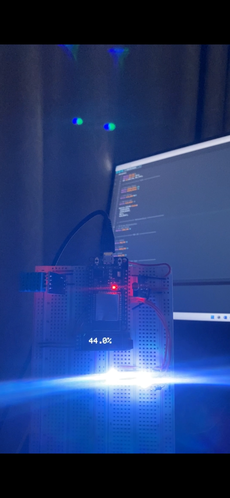

# 🌙💡 ไฟอัตโนมัติตามแสง + วัดอุณหภูมิ–ความชื้น แสดงผลบน OLED ด้วย ESP32

## 🔌 การต่อวงจร

| ESP32    | อุปกรณ์                                              |
| -------- | ---------------------------------------------------- |
| 3V3      | DHT11 ขา +, OLED VDD และ Photosensitive VCC          |
| GND      | DHT11 ขา −, OLED GND, Photosensitive GND และ RGB ขา − |
| GPIO 4   | DHT11 ขา S                                           |
| GPIO 21  | OLED SDA                                             |
| GPIO 22  | OLED SCL                                             |
| GPIO 34  | Photosensitive AO                                    |
| GPIO 32  | RGB ขา R (ผ่าน R 220Ω)                               |
| GPIO 33  | RGB ขา G (ผ่าน R 220Ω)                               |
| GPIO 25  | RGB ขา B (ผ่าน R 220Ω)                               |

```
ESP32
  │
  ├── 3V3 ──────┐
  │             │
  │          [แถว +]
  │             ├── DHT11 +
  │             ├── OLED VDD
  │             └── Photosensitive VCC
  │
  ├── GND ──────┐
  │             │
  │          [แถว -]
  │             ├── DHT11 -
  │             ├── OLED GND
  │             ├── Photosensitive GND
  │             └── RGB (-)
  │
  ├── GPIO 4 ─────── DHT11 S
  │
  ├── GPIO 21 ────── OLED SDA
  │
  ├── GPIO 22 ────── OLED SCL
  │
  ├── GPIO 34 ────── Photosensitive AO
  │
  ├── GPIO 32 ── [220Ω] ── RGB R
  │
  ├── GPIO 33 ── [220Ω] ── RGB G
  │
  └── GPIO 25 ── [220Ω] ── RGB B
```


## 📸 ผลลัพธ์

| ☀️ สว่าง LED ดับ | 🌙 มืด LED ติด (ขาว) |
| :--------------: | :-------------------: |
|  |  |
