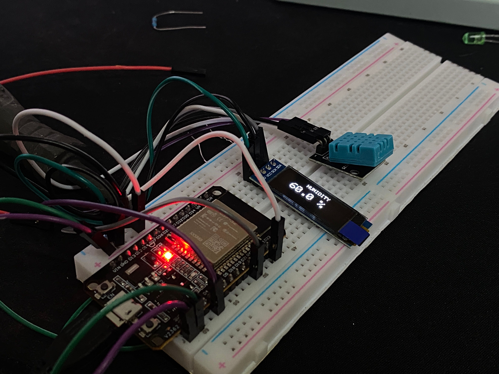

```
ESP32
  │
  ├── 3V3 ──────┐
  │             │
  │          [แถว +]
  │             ├── DHT11 +
  │             └── OLED VDD
  │
  ├── GND ──────┐
  │             │
  │          [แถว -]
  │             ├── DHT11 -
  │             └── OLED GND
  │
  ├── GPIO 4 ─────── DHT11 S
  │
  ├── GPIO 21 ────── OLED SDA
  │
  └── GPIO 22 ────── OLED SCK
  ```
  
  